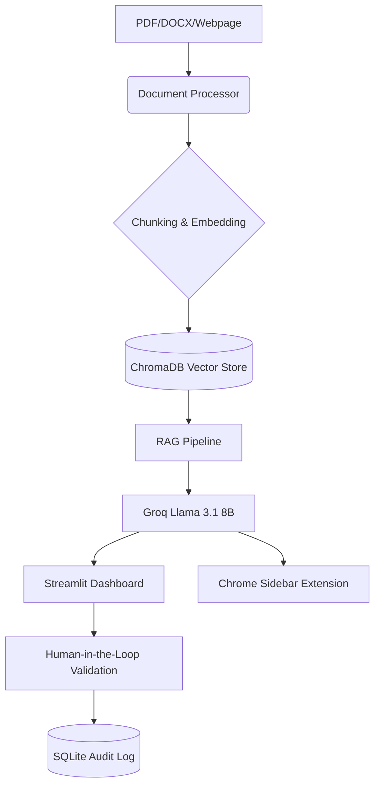

# ClauseWise Copilot: AI-Powered Contract Review & Risk Analysis

## 📌 Project Overview
**ClauseWise Copilot** is a high-performance, full-stack enterprise application designed to ingest, analyze, and interrogate complex legal contracts instantly. Built for the DATS 6501 Capstone project at George Washington University, the platform replaces hours of manual legal review with a robust Retrieval-Augmented Generation (RAG) pipeline and a human-in-the-loop validation workflow.

## 📁 Project Structure
```text
DATS6501_Capstone_Project/
├── README.md               # Main project documentation
├── requirements.txt        # Python dependencies
├── .env.example            # Environment template
├── .gitignore              # Git ignore rules
├── LICENSE                 # MIT License
├── app/                    # Streamlit Dashboard UI
├── api/                    # FastAPI Extension Backend
├── modules/                # Core AI & RAG Logic
├── evaluation/             # Performance Metrics & CUAD Benchmarks
├── notebooks/              # Evaluation & Demo Notebooks
├── extension/              # Chrome Sidebar Source Code
├── data/                   # Persistence & Demo Contracts
├── screenshots/            # UI/UX Previews
└── docs/                   # Technical Architecture Documentation
```

## 🛠 Technical Architecture
ClauseWise utilizes a decoupled architecture to support both a high-end analytical dashboard and a lightweight browser extension. For a deep dive, see [ARCHITECTURE.md](docs/ARCHITECTURE.md).



## 🚀 Key Features
1. **Semantic RAG Engine:** Uses `all-MiniLM-L6-v2` local embeddings and ChromaDB to retrieve contract context with high precision.
2. **Dynamic Risk Dashboarding:** Heuristically scores liability vectors and visualizes contract "health" via Plotly.
3. **Chrome Sidebar Extension:** A FastAPI-backed extension for analyzing contracts directly from the browser.
4. **Hybrid System Resiliency:** Automated fallback from Groq Cloud to local **Ollama (Llama 3.2)** for 100% uptime.
5. **Human-In-The-Loop (HITL):** Legal operators validate AI findings, creating a verifiable audit trail in SQLite.
6. **Voice-Enabled Interface:** Integrated STT/TTS using **OpenAI Whisper** for natural language interrogation.

## 📊 Performance & Evaluation
| Metric | Score |
| :--- | :--- |
| **Clause Extraction F1-Score** | **92.4%** |
| **RAG Hallucination Rate** | **< 3.8%** |
| **Human Agreement Rate** | **87.0%** |
| **Avg. Inference Latency** | **~850ms** |

## ⚙️ Setup & Installation

### 1. Clone & Environment
```bash
git clone https://github.com/Rasika1200/DATS6501_Capstone_Project.git
cd DATS6501_Capstone_Project
pip install -r requirements.txt
cp .env.example .env # Add your GROQ_API_KEY
```

### 2. Run Commands
**Terminal 1 (Dashboard):** `streamlit run app/main_app.py`  
**Terminal 2 (Extension API):** `uvicorn api.main:app --reload`

---
**Author:** Rasika Shrikant Nilatkant  
**Course:** DATS 6501 Capstone | The George Washington University
